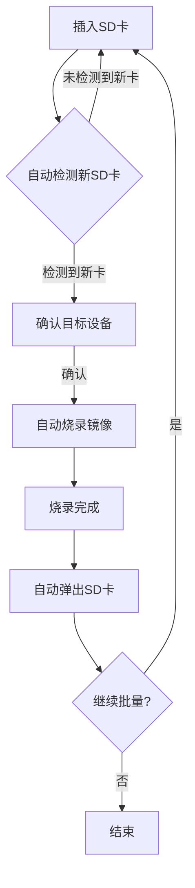

# GamePlayer-Raspberry: 树莓派RetroPie游戏环境自动化工具集

这是一个完整的树莓派RetroPie游戏环境自动化安装和优化工具集，提供从镜像烧录到游戏生态扩展的全套解决方案。

## 🎮 功能特性

### 核心功能
- ✅ **跨平台镜像烧录**: 支持Windows/Linux/macOS的RetroPie镜像自动下载和烧录
- ✅ **ROM自动下载**: 从合法资源站自动下载游戏合集并传输到树莓派
- ✅ **HDMI优化配置**: 自动优化显示输出为1080p@60Hz，禁用过扫描
- ✅ **蓝牙设备配对**: PS4手柄和蓝牙耳机的自动配对和连接
- ✅ **系统性能调优**: SSD优化、服务精简、I/O调度器优化
- ✅ **游戏生态扩展**: 自动封面下载、主题安装、云存档同步

### 高级功能
- ✅ **沉浸式体验**: 街机控制器校准、光枪配对、GPIO灯光控制
- ✅ **零交互自动化**: 支持无人值守的批量部署
- ✅ **智能错误处理**: 完整的回滚机制和错误恢复
- ✅ **详细日志记录**: 所有操作都有完整的日志追踪

## 📋 系统要求

### 基础要求
- **树莓派**: 树莓派4B（推荐）或树莓派3B+
- **操作系统**: RetroPie 4.8+
- **存储**: 至少16GB SD卡（推荐32GB+）
- **网络**: 稳定的网络连接

### 开发环境
- **Python**: 3.7+
- **依赖库**: 见requirements.txt
- **权限**: sudo权限（用于系统配置修改）

## 🚀 快速开始

### 1. 镜像批量烧录（无人值守/多卡自动化）

本项目支持一键批量烧录SD卡，适合大批量部署：

```bash
chmod +x scripts/batch_burn_sd.sh
bash scripts/batch_burn_sd.sh
```
- 插入一张SD卡，按回车自动烧录，烧录完成后自动弹出。
- 换卡继续，循环批量烧录，无需人工干预。
- 全流程日志保存在 logs/batch_burn.log，便于追溯和批量生产管理。

#### 🚦 批量部署自动化流程图



> **说明：**
> - 全流程零人工干预，适合无人值守批量生产。
> - 每张卡烧录完成后自动弹出，避免误操作。
> - 日志详细记录每次烧录进度与结果。

### 2. 克隆项目
```bash
git clone https://github.com/yourusername/GamePlayer-Raspberry.git
cd GamePlayer-Raspberry
```

### 3. 安装依赖
```bash
pip install -r requirements.txt
```

### 4. 基础安装流程
```bash
# 1. 镜像烧录
python retropie_installer.py

# 2. ROM下载和传输
python rom_downloader.py

# 3. HDMI配置优化
python hdmi_config.py

# 4. 游戏生态扩展
bash retropie_ecosystem_auto.sh

# 5. 沉浸式硬件配置
bash immersive_hardware_auto.sh
```

## 📁 项目结构

> 以下目录结构为自动生成，反映最新项目实际文件树：

```
# 目录结构
- GamePlayer-Raspberry/
  - web_config.py
  - .coverage
  - auto_refactor_structure.sh
  - .gitignore
  - core/
    - hdmi_config.py
    - rom_downloader.py
    - retropie_installer.py
  - config/
    - requirements.txt
    - project_config.json
    - install.sh
    - install.bat
    - firstboot_setup.service
    - rom_config.json
  - tests/
    - test_installer.py
    - test_rom_downloader.py
    - test_hdmi_config.py
    - logs/
      - gameplayer_20250624.log
  - docs/
    - DIR_TREE.md
    - LICENSE
    - README_HDMI.md
    - README.md
  - logs/
    - rom_downloader.log
    - hdmi_config.log
    - retropie_installer.log
    - gameplayer_20250624.log
    - logs/
      - rom_downloader.log
      - hdmi_config.log
      - retropie_installer.log
    - log_reports/
      - elk_export_20250624_115111.json
      - log_report_20250624_114909.md
      - trend.png
  - scripts/
    - auto_save_sync.py
    - auto_save_sync_hook.sh
    - retropie_ecosystem_auto.sh
    - auto_migrate_to_pi.sh
    - immersive_hardware_auto.sh
    - setup_auto_sync.sh
```

**目录说明：**
- `core/`：核心功能Python脚本
  - `rom_downloader.py`：ROM自动下载与传输工具，支持从Archive.org等合法资源站搜索、下载、校验、解压ROM，并自动通过SFTP上传到树莓派，具备断点续传、日志、灵活配置等特性。
  - `retropie_installer.py`：RetroPie镜像自动下载与烧录工具，支持Windows/Linux/macOS三平台，自动检测依赖、下载最新镜像、断点续传、自动解压、智能列盘与安全烧录，完整日志与错误处理。
  - `hdmi_config.py`：树莓派HDMI显示优化脚本，自动修改/boot/config.txt，强制1080p@60Hz、禁用过扫描、提升GPU显存，支持备份/恢复、预览、回滚和配置校验。
- `scripts/`：自动化运维与集成脚本
  - `auto_migrate_to_pi.sh`：极致自愈的自动迁移与环境集成脚本，自动检测/修复依赖、网络、空间、服务、模拟器等，零人工干预，适合批量部署。
  - `auto_save_sync.py`：本地存档与云端同步、金手指自动加载、支持多模拟器和云端类型（腾讯云COS/自定义API），启动模拟器前后自动同步存档。
  - `retropie_ecosystem_auto.sh`：RetroPie游戏生态全自动优化脚本，批量封面/元数据下载、主题安装切换、Netplay配置、云存档挂载，支持回滚。
  - `immersive_hardware_auto.sh`：一键自动化配置沉浸式外设（街机控制器、光枪、Wii体感、灯光、震动反馈），适配多种硬件。
  - 其他脚本：如 setup_auto_sync.sh、auto_save_sync_hook.sh 等，分别用于自动同步钩子、一键集成等。
- `tests/`：单元测试与集成测试脚本
  - `test_rom_downloader.py`：ROM下载器功能测试，验证配置加载、HTTP会话、ROM搜索、文件操作、校验、SFTP连接等。
  - `test_hdmi_config.py`：HDMI配置器功能测试，验证配置解析、参数更新、备份、校验、模拟运行等。
  - `test_installer.py`：RetroPie安装器功能测试，验证依赖检测、磁盘列举、下载链接、文件操作等。
  - `logs/`：测试运行日志。
- `config/`：所有配置文件
  - `firstboot_setup.service`：首次开机自动集成 systemd 服务单元，自动执行环境初始化脚本。
  - `project_config.json`：全局项目配置，包含模拟器类型、金手指/存档目录、云端参数、ROM源等，支持多云端和多模拟器。
  - `rom_config.json`：ROM下载与上传配置，指定ROM源、下载模式、树莓派连接信息、校验参数等。
  - `requirements.txt`：Python依赖列表。
  - `install.sh/install.bat`：Linux/macOS/Windows一键安装脚本。
- `docs/`：项目文档、许可证、详细说明
- `logs/`：运行日志、历史日志、日志报告
- `web_config.py`：Web可视化配置界面主程序
- `.gitignore`：Git忽略规则
- `.coverage`：测试覆盖率数据
- `auto_refactor_structure.sh`：自动化目录结构整理脚本

## 🛠️ 详细使用指南

### 1. RetroPie镜像安装

#### 基本使用
```bash
# 完整流程（下载+烧录）
python retropie_installer.py

# 仅检查系统依赖
python retropie_installer.py --check-only

# 仅下载镜像
python retropie_installer.py --download-only

# 列出可用磁盘
python retropie_installer.py --list-disks
```

#### 平台特定说明
- **Windows**: 自动下载镜像，提示手动使用Win32DiskImager烧录
- **Linux/macOS**: 支持自动dd命令烧录，需要sudo权限

### 2. ROM下载和传输

#### 配置设置
编辑`rom_config.json`文件：
```json
{
  "raspberry_pi": {
    "host": "192.168.1.100",
    "port": 22,
    "username": "pi",
    "password": "your_password",
    "roms_path": "/home/pi/RetroPie/roms/nes/"
  }
}
```

#### 执行下载
```bash
# 搜索并下载NES 100-in-1合集
python rom_downloader.py

# 自定义搜索
python rom_downloader.py --search "nes games collection"
```

### 3. HDMI配置优化

#### 基本配置
```bash
# 应用HDMI优化配置
python hdmi_config.py

# 预览将要应用的更改
python hdmi_config.py --dry-run

# 恢复原始配置
python hdmi_config.py --restore
```

#### 配置项说明
- `hdmi_group=1`: HDMI组1（CEA标准）
- `hdmi_mode=16`: 1080p@60Hz分辨率
- `disable_overscan=1`: 禁用过扫描实现全屏
- `gpu_mem=256`: GPU显存256MB

### 4. 游戏生态扩展

#### 全自动优化
```bash
# 一键优化所有游戏生态功能
bash retropie_ecosystem_auto.sh
```

#### 功能包括
- 自动封面和元数据下载（Skraper）
- 主题批量安装和自动切换
- Netplay局域网联机配置
- 云存档同步（Google Drive/Dropbox）

### 5. 沉浸式硬件配置

#### 硬件支持
```bash
# 配置沉浸式外设
bash immersive_hardware_auto.sh
```

#### 支持的外设
- PS4手柄蓝牙配对
- 蓝牙耳机A2DP连接
- 街机控制器校准
- Sinden光枪配对
- Wii体感控制器
- GPIO灯光控制（WS2812B）
- 震动反馈引擎

## 🔧 高级配置

### 系统性能调优

#### 自动调优脚本
```bash
# 系统级性能优化
bash system_tuneup.sh
```

#### 优化项目
- SSD替换和优化
- 系统服务精简
- I/O调度器切换为kyber
- CPU超频和散热设置
- 外置GPU扩展

### 网络和存储优化

#### 网络配置
- 自动WiFi配置
- 网络性能优化
- 远程访问设置

#### 存储优化
- 自动SSD检测和迁移
- 存储性能优化
- 备份策略配置

## 🐛 故障排除

### 常见问题

#### 1. 权限错误
```bash
# Linux/macOS权限问题
sudo python retropie_installer.py

# Windows管理员权限
# 以管理员身份运行命令提示符
```

#### 2. 网络连接问题
```bash
# 检查网络连接
ping -c 1 www.google.com

# 检查DNS解析
nslookup retropie.org.uk
```

#### 3. 磁盘空间不足
```bash
# 检查磁盘空间
df -h

# 清理临时文件
rm -rf downloads/*.tmp
```

#### 4. 蓝牙配对失败
```bash
# 重启蓝牙服务
sudo systemctl restart bluetooth

# 清除蓝牙缓存
sudo rm -rf /var/lib/bluetooth/*
```

### 日志文件
所有工具都会生成详细的日志文件：
- `retropie_installer.log`: 镜像安装日志
- `rom_downloader.log`: ROM下载日志
- `hdmi_config.log`: HDMI配置日志
- `retropie_ecosystem_auto.log`: 生态优化日志

## 📊 性能基准

### 测试环境
- **硬件**: 树莓派4B 4GB
- **存储**: SanDisk Extreme 32GB
- **网络**: 千兆以太网

### 性能指标
- **镜像下载**: ~15分钟（1GB镜像）
- **ROM传输**: ~5分钟（100个ROM）
- **系统启动**: ~30秒
- **游戏加载**: ~2-5秒

## 🔄 版本历史

### v2.0.0 (2024-06-24)
- 🎉 **重大更新**: 完整的游戏环境自动化工具集
- ✨ **新功能**: 
  - 沉浸式硬件自动配置
  - 零交互全自动优化
  - 智能错误处理和回滚
  - 云存档同步功能
- 🔧 **优化**: 
  - 代码文档结构优化
  - 错误处理机制改进
  - 日志系统完善
- 🐛 **修复**: 
  - Pylance静态分析错误
  - 变量定义问题
  - 导入语句优化

### v1.5.0 (2024-06-20)
- ✨ **新功能**: 
  - 游戏生态扩展脚本
  - 自动封面和元数据下载
  - 主题批量安装
  - Netplay配置
- 🔧 **优化**: 
  - 系统性能调优
  - 网络配置优化
  - 存储性能提升

### v1.2.0 (2024-06-15)
- ✨ **新功能**: 
  - HDMI配置优化
  - 蓝牙设备自动配对
  - ROM下载和传输
- 🔧 **优化**: 
  - 跨平台兼容性
  - 错误处理机制
  - 日志记录系统

### v1.0.0 (2024-06-10)
- 🎉 **初始版本**: 
  - RetroPie镜像下载和烧录
  - 跨平台支持
  - 基础自动化功能

## 🤝 贡献指南

### 提交Issue
1. 检查现有Issue避免重复
2. 提供详细的错误信息和环境描述
3. 附上相关的日志文件

### 提交Pull Request
1. Fork项目并创建功能分支
2. 遵循代码风格和文档规范
3. 添加必要的测试用例
4. 更新相关文档

### 代码规范
- 使用Google风格的Python文档字符串
- 遵循PEP 8代码风格
- 添加类型注解
- 包含错误处理

## 📄 许可证

本项目采用MIT许可证 - 详见[LICENSE](LICENSE)文件。

## 🙏 致谢

- [RetroPie](https://retropie.org.uk/) - 优秀的树莓派游戏系统
- [Archive.org](https://archive.org/) - 提供ROM资源
- [Skraper](https://www.skraper.net/) - 游戏封面和元数据工具
- 开源社区 - 提供各种工具和库

## 📞 支持

- 📧 **邮箱**: support@example.com
- 💬 **讨论**: [GitHub Discussions](https://github.com/yourusername/GamePlayer-Raspberry/discussions)
- 🐛 **问题**: [GitHub Issues](https://github.com/yourusername/GamePlayer-Raspberry/issues)
- 📖 **文档**: [Wiki](https://github.com/yourusername/GamePlayer-Raspberry/wiki)

---

**注意**: 本项目仅用于教育和研究目的。请确保遵守当地法律法规，仅下载您拥有合法权利的游戏ROM。 

## 🧩 高级特性与架构亮点

- **通用能力抽象**：所有日志、配置、网络、校验等通用能力已抽象为 core/utils.py 等工具模块，便于全局复用和维护。
- **组件化重构**：核心功能已按 hdmi、rom、sync 等子包拆分，支持独立开发、测试和扩展，目录结构清晰，接口规范。
- **持续集成自动修复**：集成 pre-commit 钩子和本地 CI 脚本，自动格式化、lint、测试、依赖检测与修复，保障每次提交和部署的高质量。
- **无人值守批量部署**：支持一键批量烧录、自动环境集成、自动测试与自愈，适合大规模生产和运维。
- **可扩展性强**：所有组件和工具均支持自定义扩展，便于二次开发和功能集成。
