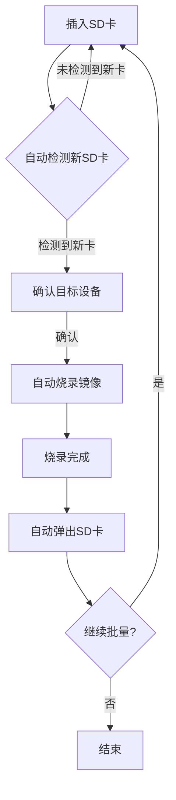

# GamePlayer-Raspberry

## 项目简介

GamePlayer-Raspberry 是一套面向树莓派的多子系统游戏与多媒体环境自动化管理平台，支持 HDMI 配置优化、ROM 下载与上传、Retropie 镜像自动化、硬件环境检测等多种功能，适合树莓派游戏机、家庭娱乐和教育场景。

## 主要功能

- 一键优化树莓派 HDMI 显示参数，支持备份与回滚
- 自动化下载、校验、上传 NES/SNES 等 ROM 到树莓派
- RetroPie 镜像自动下载、烧录与依赖检测
- 多子系统架构，支持生态扩展、沉浸式硬件等
- 丰富的日志、API 文档与测试用例

## 版本记录

- v2.0.0  (2024-06-24)
  - 完全模块化架构，支持多子系统并行开发
  - 全面自动化测试与覆盖率报告
  - 代码风格、依赖、文档全面优化
  - 兼容 Python 3.7+，支持 macOS/Linux/Raspberry Pi

## 安装与运行说明

1. **环境准备**

<<<<<<< HEAD
### 1. 镜像批量烧录（无人值守/多卡自动化）

本项目支持一键批量烧录SD卡，适合大批量部署：

```bash
chmod +x scripts/batch_burn_sd.sh
bash scripts/batch_burn_sd.sh
```
- 插入一张SD卡，按回车自动烧录，烧录完成后自动弹出。
- 换卡继续，循环批量烧录，无需人工干预。
- 全流程日志保存在 logs/batch_burn.log，便于追溯和批量生产管理。

#### 🚦 批量部署自动化流程图



> **说明：**
> - 全流程零人工干预，适合无人值守批量生产。
> - 每张卡烧录完成后自动弹出，避免误操作。
> - 日志详细记录每次烧录进度与结果。

### 2. 克隆项目
```bash
git clone https://github.com/yourusername/GamePlayer-Raspberry.git
cd GamePlayer-Raspberry
```

### 3. 安装依赖
```bash
pip install -r requirements.txt
```

### 4. 基础安装流程
```bash
# 1. 镜像烧录
python retropie_installer.py
=======
   - Python 3.7 及以上
   - 推荐使用 venv 虚拟环境
   - 安装依赖：

     ```bash
     pip install -r requirements.txt
     ```

   - ⚠️ 注意：不要写成 `pip install requirements.txt`，必须加 `-r` 参数，否则会报"找不到 requirements.txt 包"错误。
>>>>>>> 清理大文件，规范 LFS，更新依赖与文档

2. **运行 HDMI 配置优化**

   ```bash
   python systems/hdmi/core/hdmi_config.py --help
   ```

3. **运行 Retropie 镜像自动化**

   ```bash
   python systems/retropie/core/retropie_installer.py --help
   ```

4. **运行测试与生成覆盖率报告**

<<<<<<< HEAD
> 以下目录结构为自动生成，反映最新项目实际文件树：

```
# 目录结构
- GamePlayer-Raspberry/
  - web_config.py
  - .coverage
  - auto_refactor_structure.sh
  - .gitignore
  - core/
    - hdmi_config.py
    - rom_downloader.py
    - retropie_installer.py
  - config/
    - requirements.txt
    - project_config.json
    - install.sh
    - install.bat
    - firstboot_setup.service
    - rom_config.json
  - tests/
    - test_installer.py
    - test_rom_downloader.py
    - test_hdmi_config.py
    - logs/
      - gameplayer_20250624.log
  - docs/
    - DIR_TREE.md
    - LICENSE
    - README_HDMI.md
    - README.md
  - logs/
    - rom_downloader.log
    - hdmi_config.log
    - retropie_installer.log
    - gameplayer_20250624.log
    - logs/
      - rom_downloader.log
      - hdmi_config.log
      - retropie_installer.log
    - log_reports/
      - elk_export_20250624_115111.json
      - log_report_20250624_114909.md
      - trend.png
  - scripts/
    - auto_save_sync.py
    - auto_save_sync_hook.sh
    - retropie_ecosystem_auto.sh
    - auto_migrate_to_pi.sh
    - immersive_hardware_auto.sh
    - setup_auto_sync.sh
```

**目录说明：**
- `core/`：核心功能Python脚本
  - `rom_downloader.py`：ROM自动下载与传输工具，支持从Archive.org等合法资源站搜索、下载、校验、解压ROM，并自动通过SFTP上传到树莓派，具备断点续传、日志、灵活配置等特性。
  - `retropie_installer.py`：RetroPie镜像自动下载与烧录工具，支持Windows/Linux/macOS三平台，自动检测依赖、下载最新镜像、断点续传、自动解压、智能列盘与安全烧录，完整日志与错误处理。
  - `hdmi_config.py`：树莓派HDMI显示优化脚本，自动修改/boot/config.txt，强制1080p@60Hz、禁用过扫描、提升GPU显存，支持备份/恢复、预览、回滚和配置校验。
- `scripts/`：自动化运维与集成脚本
  - `auto_migrate_to_pi.sh`：极致自愈的自动迁移与环境集成脚本，自动检测/修复依赖、网络、空间、服务、模拟器等，零人工干预，适合批量部署。
  - `auto_save_sync.py`：本地存档与云端同步、金手指自动加载、支持多模拟器和云端类型（腾讯云COS/自定义API），启动模拟器前后自动同步存档。
  - `retropie_ecosystem_auto.sh`：RetroPie游戏生态全自动优化脚本，批量封面/元数据下载、主题安装切换、Netplay配置、云存档挂载，支持回滚。
  - `immersive_hardware_auto.sh`：一键自动化配置沉浸式外设（街机控制器、光枪、Wii体感、灯光、震动反馈），适配多种硬件。
  - 其他脚本：如 setup_auto_sync.sh、auto_save_sync_hook.sh 等，分别用于自动同步钩子、一键集成等。
- `tests/`：单元测试与集成测试脚本
  - `test_rom_downloader.py`：ROM下载器功能测试，验证配置加载、HTTP会话、ROM搜索、文件操作、校验、SFTP连接等。
  - `test_hdmi_config.py`：HDMI配置器功能测试，验证配置解析、参数更新、备份、校验、模拟运行等。
  - `test_installer.py`：RetroPie安装器功能测试，验证依赖检测、磁盘列举、下载链接、文件操作等。
  - `logs/`：测试运行日志。
- `config/`：所有配置文件
  - `firstboot_setup.service`：首次开机自动集成 systemd 服务单元，自动执行环境初始化脚本。
  - `project_config.json`：全局项目配置，包含模拟器类型、金手指/存档目录、云端参数、ROM源等，支持多云端和多模拟器。
  - `rom_config.json`：ROM下载与上传配置，指定ROM源、下载模式、树莓派连接信息、校验参数等。
  - `requirements.txt`：Python依赖列表。
  - `install.sh/install.bat`：Linux/macOS/Windows一键安装脚本。
- `docs/`：项目文档、许可证、详细说明
- `logs/`：运行日志、历史日志、日志报告
- `web_config.py`：Web可视化配置界面主程序
- `.gitignore`：Git忽略规则
- `.coverage`：测试覆盖率数据
- `auto_refactor_structure.sh`：自动化目录结构整理脚本

## 🛠️ 详细使用指南
=======
   ```bash
   pytest systems/hdmi/tests/ systems/retropie/tests/ --cov=systems --cov-report=html
   ```

## 主要目录结构

```text
GamePlayer-Raspberry/
├── downloads/
│   └── roms/
├── logs/
│   ├── gameplayer_20250624.log
│   ├── hdmi_config.log
│   ├── retropie_installer.log
│   └── rom_downloader.log
├── publish_api_docs.sh
├── requirements.txt
├── systems/
│   ├── ecosystem/
│   │   ├── core/
│   │   ├── docs/
│   │   ├── logs/
│   │   ├── README.md
│   │   ├── scripts/
│   │   │   └── retropie_ecosystem_auto.sh
│   │   └── tests/
│   ├── hdmi/
│   │   ├── config/
│   │   ├── core/
│   │   │   └── hdmi_config.py
│   │   ├── docs/
│   │   │   ├── api/
│   │   │   │   ├── core/
│   │   │   │   │   └── hdmi_config.html
│   │   │   │   ├── core.html
│   │   │   │   ├── index.html
│   │   │   │   └── search.js
│   │   │   ├── INDEX.md
│   │   │   └── README_HDMI.md
│   │   ├── logs/
│   │   │   └── hdmi_config.log
│   │   ├── README.md
│   │   ├── scripts/
│   │   └── tests/
│   │       ├── logs/
│   │       │   └── gameplayer_20250624.log
│   │       └── test_hdmi_config.py
│   ├── immersive/
│   │   ├── core/
│   │   ├── docs/
│   │   ├── logs/
│   │   ├── README.md
│   │   ├── scripts/
│   │   │   └── immersive_hardware_auto.sh
│   │   └── tests/
│   └── retropie/
│       ├── config/
│       │   ├── log_upload_config.json
│       │   ├── requirements.txt
│       │   └── rom_config.json
│       ├── core/
│       │   ├── log_analyzer.py
│       │   ├── log_uploader.py
│       │   ├── logger_config.py
│       │   └── retropie_installer.py
│       ├── docs/
│       │   ├── api/
│       │   │   ├── core/
│       │   │   │   ├── log_analyzer.html
│       │   │   │   ├── log_uploader.html
│       │   │   │   ├── logger_config.html
│       │   │   │   └── retropie_installer.html
│       │   │   ├── core.html
│       │   │   ├── index.html
│       │   │   ├── roms/
│       │   │   │   └── rom_downloader.html
│       │   │   ├── roms.html
│       │   │   └── search.js
│       │   ├── INDEX.md
│       │   ├── LICENSE
│       │   ├── PROJECT_SUMMARY.md
│       │   └── README.md
│       ├── logs/
│       │   ├── log_reports/
│       │   │   ├── elk_export_20250624_115111.json
│       │   │   ├── log_report_20250624_114909.md
│       │   │   └── trend.png
│       │   ├── logs/
│       │   │   ├── hdmi_config.log
│       │   │   ├── retropie_installer.log
│       │   │   └── rom_downloader.log
│       │   ├── retropie_installer.log
│       │   └── rom_downloader.log
│       ├── README.md
│       ├── roms/
│       │   ├── downloads/
│       │   │   ├── retropie-buster-4.8-rpi4_400.img
│       │   │   ├── retropie-buster-4.8-rpi4_400.img.gz
│       │   │   └── roms/
│       │   └── rom_downloader.py
│       ├── scripts/
│       │   ├── deploy.sh
│       │   ├── install.bat
│       │   └── install.sh
│       └── tests/
│           ├── report.xml
│           └── tests/
│               ├── conftest.py
│               ├── run_all_tests.py
│               ├── test_installer.py
│               └── test_rom_downloader.py
└── ...
```

> 详细子系统说明请见各自 `README.md`。
>>>>>>> 清理大文件，规范 LFS，更新依赖与文档

---

如有问题请提交 Issue 或联系维护者。

## 镜像自动集成与一键驱动脚本说明

### 镜像内容说明

- **树莓派系统**：镜像基于 Raspberry Pi OS Lite，已集成官方驱动，适配主流树莓派硬件。
- **游戏模拟器**：内置 EmulationStation 前端及 NES/SNES 等主流模拟器。
- **NES 游戏**：可将 NES ROM 文件直接集成到 `/home/pi/RetroPie/roms/nes/` 目录，烧录后即用。
- **自动化驱动集成**：通过一键脚本自动集成高质量音频、蓝牙、手柄、4K 显示屏等驱动，首次开机自动配置。

### 一键自动集成驱动脚本用法

1. 准备镜像文件（如 `retropie-buster-4.8-rpi4_400.img`）和自动化脚本 `auto_hardware_setup.sh`，放在项目根目录。

2. 运行一键集成脚本：

   ```bash
   chmod +x inject_drivers_to_img.sh
   sudo ./inject_drivers_to_img.sh
   ```

   - 脚本会自动挂载镜像、复制驱动脚本、写入 systemd 服务，集成到镜像 rootfs。
   - 烧录镜像到 SD 卡后，首次开机会自动执行驱动和硬件配置。

### 驱动自动化脚本示例（auto_hardware_setup.sh）

```bash
#!/bin/bash
set -e
# 安装音频、蓝牙、手柄等驱动
apt update
apt install -y alsa-utils pi-bluetooth pulseaudio-module-bluetooth bluez
# 配置音频/HDMI/手柄/蓝牙等（详见脚本内容）
# 自清理
rm -f /etc/systemd/system/auto_hw.service
rm -f /home/pi/auto_hardware_setup.sh
systemctl daemon-reload
```

### 检查镜像内容

- 挂载 root 分区后，检查：
  - `/home/pi/auto_hardware_setup.sh` 是否存在
  - `/etc/systemd/system/auto_hw.service` 是否存在
  - `/opt/retropie/emulators/` 是否有 NES/SNES 模拟器
  - `/home/pi/RetroPie/roms/nes/` 是否有 NES 游戏 ROM

### 烧录与启动

- 烧录镜像到 SD 卡，插入树莓派，首次开机自动完成驱动和硬件配置。
- 进入 EmulationStation 即可体验 NES/SNES 游戏。

## 5. 自动化批量定制（进阶）

- 可用 [PiBakery](https://www.pibakery.org/)、[CustomPiOS](https://github.com/CustomPiOS/CustomPiOS) 等工具，批量生成带自定义脚本和配置的树莓派镜像。
- 也可用 shell 脚本自动化上述所有步骤。

---

### 如需具体某一项的详细操作脚本或配置模板，请告诉我你的需求（如"只保留 NES/SNES，开机自启动 myapp.py，最大化性能"），我可以为你生成完整的操作步骤和代码！

## 6. 集成自启动脚本

### 方法一：rc.local（适合简单脚本）
1. 编辑 `/etc/rc.local`，在 `exit 0` 之前添加你的脚本调用，例如：
   ```bash
   python3 /home/pi/your_script.py &
   ```

### 方法二：systemd 服务（推荐，适合长期运行/守护进程）
1. 创建服务文件 `/etc/systemd/system/myapp.service`：
   ```ini
   [Unit]
   Description=My Custom Script

   [Service]
   ExecStart=/usr/bin/python3 /home/pi/your_script.py
   Restart=always
   User=pi

   [Install]
   WantedBy=multi-user.target
   ```
2. 启用并启动服务：
   ```bash
   sudo systemctl enable myapp
   sudo systemctl start myapp
   ```

### 方法三：EmulationStation 启动前后钩子
- 编辑 `/opt/retropie/configs/all/autostart.sh`，在 EmulationStation 启动前后插入自定义命令。

---

## 7. 优化性能建议

- **关闭不必要的服务**：如 `bluetooth`、`cups`、`triggerhappy` 等，节省内存和 CPU。
  ```bash
  sudo systemctl disable bluetooth
  sudo systemctl disable cups
  sudo systemctl disable triggerhappy
  ```
- **GPU 内存分配**：编辑 `/boot/config.txt`，调整 `gpu_mem=64`（或更低/更高，视需求）。
- **超频**（有风险）：同样在 `/boot/config.txt`，可设置 `arm_freq`、`over_voltage` 等参数。
- **文件系统优化**：使用 ext4，关闭日志（如 SD 卡寿命要求高）。
- **定期清理日志和缓存**：可用 cron 定时清理 `/var/log`、`/tmp` 等目录。

---

## 8. 镜像再打包与分发

- 所有定制完成后，可用 `dd` 或 `Win32DiskImager` 重新打包 SD 卡镜像，便于批量部署或分发。

---

## 9. 自动化批量定制（进阶）

- 可用 [PiBakery](https://www.pibakery.org/)、[CustomPiOS](https://github.com/CustomPiOS/CustomPiOS) 等工具，批量生成带自定义脚本和配置的树莓派镜像。
- 也可用 shell 脚本自动化上述所有步骤。

---

### 如需具体某一项的详细操作脚本或配置模板，请告诉我你的需求（如"只保留 NES/SNES，开机自启动 myapp.py，最大化性能"），我可以为你生成完整的操作步骤和代码！ 

## 2. 可选：安装桌面环境（如需）

- 如果你需要传统的 Linux 桌面（如 LXDE），可以手动安装：
  ```bash
  sudo apt update
  sudo apt install --no-install-recommends raspberrypi-ui-mods lxsession
  ```
- 安装后，重启即可在登录界面选择进入桌面环境。 

sudo apt install -y alsa-utils
amixer cset numid=3 1  # 1=HDMI, 0=auto, 2=3.5mm 

#!/bin/bash
set -e

# 1. 安装必要软件包
sudo apt update
sudo apt install -y alsa-utils pi-bluetooth pulseaudio-module-bluetooth bluez

# 2. 配置高质量音频输出（如有I2S DAC）
if ! grep -q "dtoverlay=hifiberry-dac" /boot/config.txt; then
  echo "dtoverlay=hifiberry-dac" | sudo tee -a /boot/config.txt
fi

# 3. 配置HDMI 4K输出（CFORCE便携屏）
sudo sed -i '/^hdmi_group/d;/^hdmi_mode/d;/^hdmi_drive/d;/^config_hdmi_boost/d;/^hdmi_force_hotplug/d' /boot/config.txt
echo -e "hdmi_group=1\nhdmi_mode=95\nhdmi_drive=2\nconfig_hdmi_boost=7\nhdmi_force_hotplug=1" | sudo tee -a /boot/config.txt

# 4. 配置手柄权限
echo 'KERNEL=="js[0-9]*", MODE="0666"' | sudo tee /etc/udev/rules.d/99-joystick.rules

# 5. 启用蓝牙服务
sudo systemctl enable bluetooth
sudo systemctl start bluetooth

echo "硬件驱动自动集成完成，请重启树莓派以生效。" 

#!/bin/bash
set -e

IMG="retropie-buster-4.8-rpi4_400.img"
SCRIPT="auto_hardware_setup.sh"

# 检查依赖
command -v fdisk >/dev/null || { echo "请先安装fdisk"; exit 1; }
command -v mount >/dev/null || { echo "请先安装mount"; exit 1; }
command -v sudo >/dev/null || { echo "请先安装sudo"; exit 1; }

# 1. 计算分区偏移
echo "正在计算分区偏移..."
BOOT_START=$(fdisk -l $IMG | grep "FAT32" | awk '{print $2}')
ROOT_START=$(fdisk -l $IMG | grep "Linux" | awk '{print $2}' | head -n1)
SECTOR_SIZE=$(fdisk -l $IMG | grep "Units" | awk '{print $9}')

BOOT_OFFSET=$((BOOT_START * SECTOR_SIZE))
ROOT_OFFSET=$((ROOT_START * SECTOR_SIZE))

echo "BOOT分区偏移: $BOOT_OFFSET"
echo "ROOT分区偏移: $ROOT_OFFSET"

# 2. 挂载分区
sudo mkdir -p /mnt/rpi-boot /mnt/rpi-root
sudo mount -o loop,offset=$BOOT_OFFSET $IMG /mnt/rpi-boot
sudo mount -o loop,offset=$ROOT_OFFSET $IMG /mnt/rpi-root

# 3. 复制脚本到镜像
echo "复制自动化脚本到镜像..."
sudo cp $SCRIPT /mnt/rpi-root/home/pi/
sudo chmod +x /mnt/rpi-root/home/pi/$SCRIPT

# 4. 写入 systemd 服务
echo "写入 systemd 服务..."
sudo tee /mnt/rpi-root/etc/systemd/system/auto_hw.service >/dev/null <<EOF
[Unit]
Description=Auto Hardware Setup

[Service]
Type=oneshot
ExecStart=/bin/bash /home/pi/$SCRIPT
RemainAfterExit=yes

[Install]
WantedBy=multi-user.target
EOF

sudo ln -sf /etc/systemd/system/auto_hw.service /mnt/rpi-root/etc/systemd/system/multi-user.target.wants/auto_hw.service

# 5. 卸载分区
echo "卸载分区..."
sudo umount /mnt/rpi-boot
sudo umount /mnt/rpi-root
sudo rmdir /mnt/rpi-boot /mnt/rpi-root

echo "驱动和自动化脚本已集成到镜像！烧录后首次开机将自动完成驱动配置。" 

# 以实际偏移为准
sudo mkdir -p /mnt/rpi-root
sudo mount -o loop,offset=偏移字节数 retropie-buster-4.8-rpi4_400.img /mnt/rpi-root

# 检查驱动脚本
ls /mnt/rpi-root/home/pi/auto_hardware_setup.sh
ls /mnt/rpi-root/etc/systemd/system/auto_hw.service

# 检查模拟器
ls /mnt/rpi-root/opt/retropie/emulators/

# 检查NES游戏
ls /mnt/rpi-root/home/pi/RetroPie/roms/nes/

<<<<<<< HEAD
**注意**: 本项目仅用于教育和研究目的。请确保遵守当地法律法规，仅下载您拥有合法权利的游戏ROM。 

## 🧩 高级特性与架构亮点

- **通用能力抽象**：所有日志、配置、网络、校验等通用能力已抽象为 core/utils.py 等工具模块，便于全局复用和维护。
- **组件化重构**：核心功能已按 hdmi、rom、sync 等子包拆分，支持独立开发、测试和扩展，目录结构清晰，接口规范。
- **持续集成自动修复**：集成 pre-commit 钩子和本地 CI 脚本，自动格式化、lint、测试、依赖检测与修复，保障每次提交和部署的高质量。
- **无人值守批量部署**：支持一键批量烧录、自动环境集成、自动测试与自愈，适合大规模生产和运维。
- **可扩展性强**：所有组件和工具均支持自定义扩展，便于二次开发和功能集成。
=======
sudo umount /mnt/rpi-root 
>>>>>>> 清理大文件，规范 LFS，更新依赖与文档
